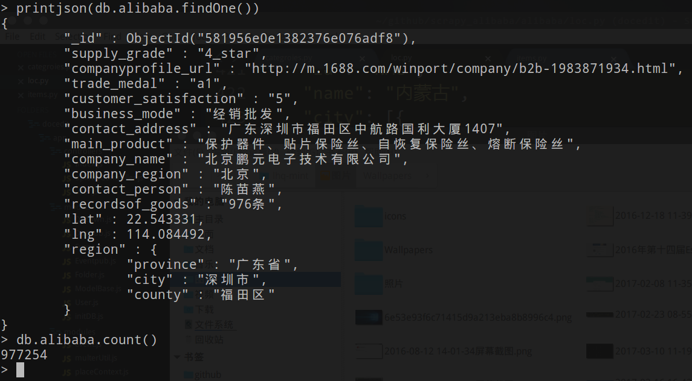

# 2018年01月23日
# 罢了，获取于2016年上半年的数据997254条，带坐标,误差肯定是存在的，[百度云链接_密码: 1234](https://pan.baidu.com/s/1qZdILLa)
# 挂了，留个纪念
# 基于scrapy爬取ali巴巴[移动版](http://m.1688.com)的供货商公司信息的爬虫
*依赖包：BeautifulSoup,scrapy*

### 运行方法
```
cd ./scrapy_alibaba
scrapy crawl ali88
```
### 数据保存在本地mongdb:27017/alibaba_test数据库下,可在setting.py中修改mongo设置,更多参考[scrapy文档](https://docs.scrapy.org/en/latest/)。


*注：截图中地理坐标和区域是后续地理编码处理加上的，不包含在这里*
